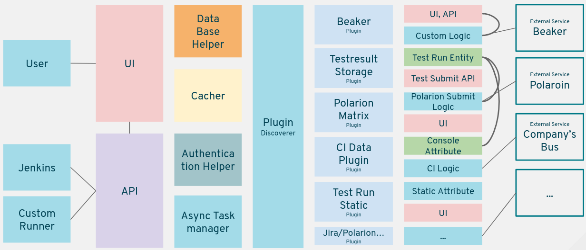

Quick start
====================================

*This article will demostrate how to setup metadash and
implement a simple Plugin*

Setup Development Enviroment
====================================

Metadash provided a setup.sh, which can help you setup the development
enviroment quickly.

It's highly recommanded to use virtualenv to wrap up you Python enviroment.

Once you are ready to go, just enter:

    .. code-block:: shell

        ./setup.sh --dev

It will execute pip and npm, and install packages required Python and Node packages,
no prviliage permission required.

Wait for a few minutes for the installation to finish, and now you should have a working
development enviroment.

If anything error shows up make sure you have required system packages installed.

Firt, start the development flask server, execute:

    .. code-block:: shell

        python manager.py runserver --listen 0.0.0.0

Then you should start the UI development server, and execute:

    .. code-block:: shell

        node run ui-dev

Now the server (both frontend and backend) will auto refresh and hot reload as you change the code and save the change,
which should provide you a very friendly development enviroment.

**Please be aware, celery workers, async tasks, and high performance caching won't work in development enviroment**

Basic Struture of Metadash
====================================

This project uses multiple opensource projects, backend server is built using Flask and SQLAlchemy,
to archive high flexiblity, generic foreign key supported was added, and implemented serveral ORM level
helpers to make EAV strucutre easy to use and easy to cache. Cachine introduced to reduce the performance
drop. And for better caching management (cache invalidation and regenerate) and to support backgroud peridic
tasks, Celery is used as the worker engine.

Frontend built with Vue.js and PatternFly, webpack is used to packup every thing, and plugins were loaded
by both webpack and python, so frontend and backend share the same plugin library.

To make it easier to manage plugins, the whole project is maintain and developed in a single git repository.

An overview of the whole structure:

Basic Struture of a Plugin
====================================

A Plugins in Metadash is just a collection of following components:

    - Flask Blueprint

      Reference: http://flask.pocoo.org/docs/0.12/blueprints/

      If you want to provide HTTP api at /api/<something>, you will need to
      create a Flask Blueprint that will registed to that location.

    - Vue Component

      Reference: https://vuejs.org/v2/guide/components.html

      Metadash uses Vue component to orgnize all frontend parts. If you are creating
      a new page, you will need to create a Vue component.

    - SQLAlchemy Model

      Reference: http://flask-sqlalchemy.pocoo.org/2.3/

      *(Models in Metadash is a bit different than usual Flask-Sqlalchemy project,
      will talk about more detail in later secions)*

      If you need to store any kinds of data, it's recommanded to wrap it with
      SQLAlchemy's ORM layer for better abstraction.

    - Celery Task

      Reference: http://docs.celeryproject.org/en/latest/userguide/tasks.html

      Sometime schedule task or backgroud task is required to grab info, flush cache,
      then Celery is here to help, it dispatch the work to Celery worker so we can have
      schedulable, peridic task, and offload the main server for better performance.

Writing A Plugin
====================================

Plugins are placed at 'metadash/plugins/', metadash/plugins/example contains a minimized plugin, feel free to refer to any plugin as example.

- To create a plugin named 'foo-plugin'

    create folder 'metadash/plugins/foo-plugin'

    create 'metadash/plugins/foo-plugin/plugin.json' with following content (modify as your need)

    .. code-block:: json

        {
            "name": "foo-unique-name",
            "author": "Kairui Song",
            "description": "Foo Plugin",
            "configs": {
                "EXAMPLE_CONFIG": {
                   "description": "Example Config",
                   "default": null,
                   "secret": false,
                   "nullable": false
                }
            },
            "version": "0.0.0"
        }

- Following parts (API, Models, Components) are optional

    If your plugin contains some front-end interface, you should implement it in 'metadash/plugins/foo-plugin/components'
    a 'metadash/plugins/foo-plugin/components/index.js' is required to let metadash discovery this plugins front-end component:

    .. code-block:: javascript

        import component from './app.vue'
        export default {
            path: '/foo', // Need to be unique, and will be used for url routing
            icon: '<i class="fa fa-info" aria-hidden="true"></i>', // you can use anything as the icon
            entry: component,
            title: 'Foo Plugin'
        }

    As you can see, in above code, a component is being imported and declared as the entry of this plugin, so you need to create a 'metadash/plugins/foo-plugin/components/app.vue' (you can change the name, just remember also change the import statement to make sure the right component is being imported and set as entry)

    .. code-block:: html

        <template>
            

                <h1>{{ msg }}</h1>
            

        </template>
        
        <!-- Add "scoped" attribute to limit CSS to this component only -->
        

    *(Above code shows a minimized component, you can use anything based on Vue's component)*

    If nothing went wrong, start or restart the devel server the you will see an extra plugin tab with title 'Foo Plugin', showing 'Hello World!'

- If your plugin provide some extra HTTP API calls, you should create the API part.
  a 'metadash/plugins/foo-plugin/apis/__init__.py' is required to let metadash discovery this plugin's API layer:

    .. code-block:: python

        from flask import Blueprint, jsonify
        app = Blueprint = Blueprint('foo', __name__)
        @app.route('/get-foo')
        def get(self):
            return jsonify({
                'message': 'Hello world!'
            }), 200

    *(Above code shows a minimized API module, you can use anything based on Flask's Blueprint)*

- If your plugin need to store some data, it's recommended to implement them in  and use helpers provided by Metadash
  This part is very flexible, you can ignore Metadash's helper and use your own way to read / progress / store data. But metadash provides some very useful helper for doing this.
  Metadash will try to import 'metadash/plugins/foo-plugin/models/__init__.py', so every thing declared in this file is guarantee to be imported.

    .. code-block:: python

        """
        An example on storing data with metadash's helper
        """
        import time
        from metadash.models.base import EntityModel
        from metadash.injector import provide
        from metadash.cache import cache_on_entity, cached_entity_property
        from metadash import db

        @provide('example')
        class ExampleEntity(EntityModel): # Inherit from EntityModel, so have a UUID
            """
            Example Entity
            """
            __tablename__ = __alias__ = __namespace__ = 'example'
            name = db.Column(db.String(32), primary_key=True, nullable=False)
            @cache_on_entity()
            def cached_function(self):
                return 'Cached Function'
            @cached_entity_property()
            def cached_property(self):
                time.sleep(1)
                return 'Cached Property'

    Above code showed some usage of metadash's helper (Caching, ORM, EAV, Dependency Injection), EntityModel is based on SQLAlchemy's ORM and also make use of Flask-SQLAlchemy more docs coming later.
